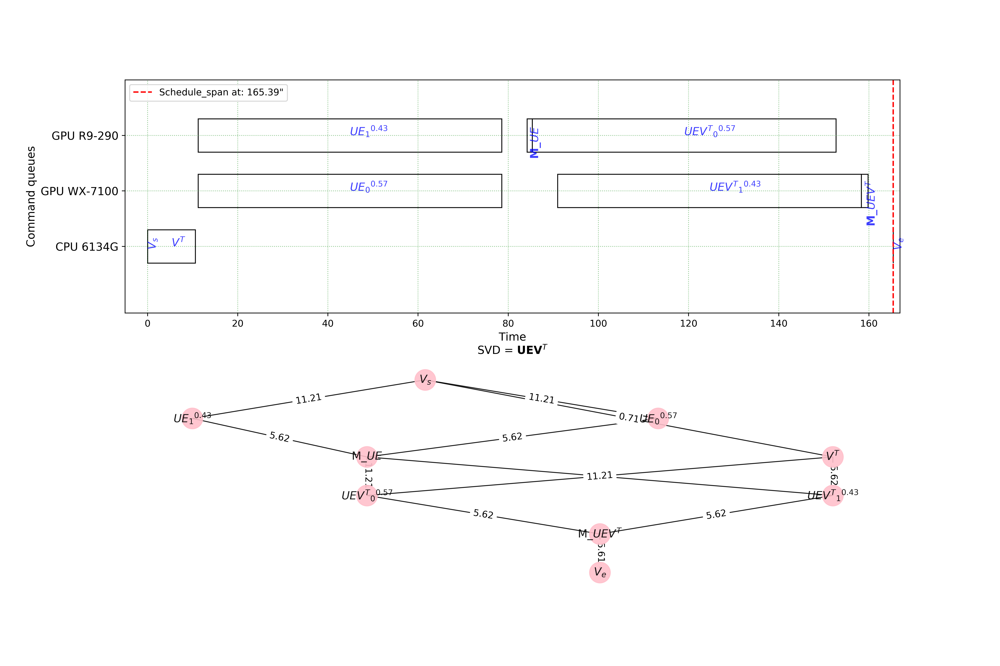

What is this ? 
--------------

The schedule module calculates the execution schedule for some input OpenCL kernel-graph. There are several test-applications consisting of multiple kerenels (see mkmd_apps.py module). In the kernel-graph each node represents a kernel function. For each kernel-function there are profiled execution times to calculate a node-weights. For the graph-edges and theit weights the schedule-module uses profiled bandwidth for platform-specific interconnection-bus between CPUs-GPUs. Once the schedule is calculated the schedule-module analyzes the data-flow between nodes and generates a graphCL-commands.

Structure 
--------------

- main.py -- main module that enables to start the calculation of schedule for the test-applications in mkmd_apps.py
- dag.py -- this module includes GraphCL-API to create the mkmd_apps.py
- evaluate.py -- this module calculates the speeedup of calculated schedule vs. some theoretical speedup and single-device graph schedule.
- heft.py -- this module calculates the HEFT-schedule.
- mkmd.py -- this module includes the profiled execution times for mkmd_apps.py on tested-platforms.  
- mkmd_apps.py -- this module includes several multi-kernel applications.
- schedule.py -- this module creates the node-matrix and edge-matrix for graph with nodes/sub-nodes. It also generates the dispatch-commands for GraphCL-runtime.
- visualize.py -- this module includes functions to draw: a) the task graph with nodes and edges b) Gantt-chart with the calculated schedule

How to use it and what it gets
--------------
usage: main.py [-h] [--mkmd_name MKMD_NAME] [--partition_sub_kernel_on]
               [--partition_sub_kernel_off]

In short the main module includes three inputs (see above) to control the application. There are also internal flags that change the behaviour too.

The following image illustrates the results of schedule-module:

Requirements 
---------------
check Requirements.txt to find out last-working version of python modules

References 
---------------
The schedule-module uses the HEFT implementation (https://github.com/mackncheesiest/heft).
